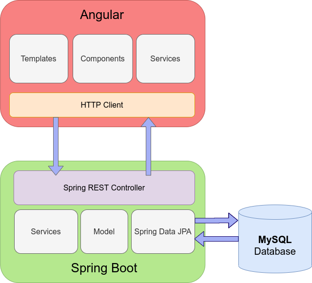

Hey..
in case you are wondering how this app works.. it is pretty simple.  
**Structure** : It is only built on one service as you see
To start the app locally. under the pic you can find the instructions

  

1. download docker desktop and run it
2. open command line and type :
   ***docker build -t boxing-fever .***
3. again DO NOT forget the . at the end please
4. co to your command line again type ***cd ./docker-compose***
5. then type ***docker-compose up***

